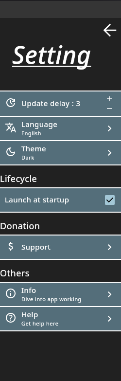

## Library to make setting easily

Hosted on [Jitpack](https://jitpack.io/#wiiznokes/setting-sliding-windows)

### Install

Groovy

```
allprojects {
    repositories {
        ...
        maven { url 'https://jitpack.io' }
    }
}
```

```
dependencies {
    implementation 'com.github.wiiznokes:setting-sliding-windows:$version'
}
```

Kotlin

```
repositories {
    ...
    maven("https://jitpack.io")
}
```

```
dependencies {
    implementation("com.github.wiiznokes:setting-sliding-windows:$version")
}
```




This lib use material 3

An example on how to use it can be
found [here](https://github.com/wiiznokes/setting-sliding-windows/blob/master/src/jvmTest/kotlin/settingTest.kt)
